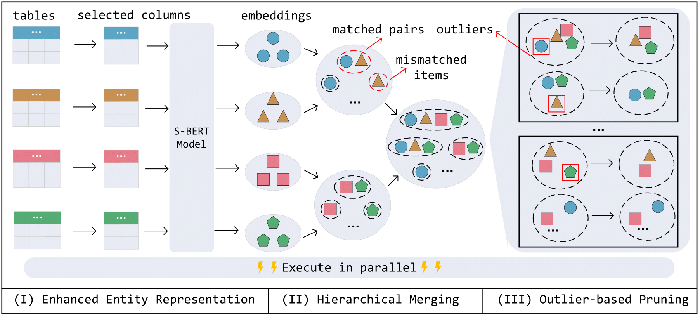

# MultiEM

MultiEM is a effective and efficient solution for multi-table entity matching. To overcome the efficiency challenge, we present a parallelizable tablewise hierarchical merging algorithm to accelerate the matching of multiple tables. Furthermore, to address the effectiveness challenge, in MultiEM, we enhance the entity representation quality by a novel automated attribute selection strategy and handle transitive conflicts by hierarchical merging, which explicitly avoids the disjointed process of generating matched pair and converting pairs to tuples. Moreover, we develop a density-based pruning strategy to erase outliers and further improve the matching effectiveness.



## Datasets

See `./data` for more details.

## Requirements

- sklearn
- pandas
- numpy
- sentence-transformers
- networkx
- joblib
- hnswlib
- tyro
- pyfunctional
- loguru

## Quick Start

```bash
python main.py --data-name Geo
```

See `./args.py` for more about the configuration.
